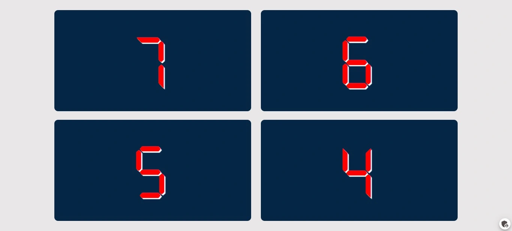
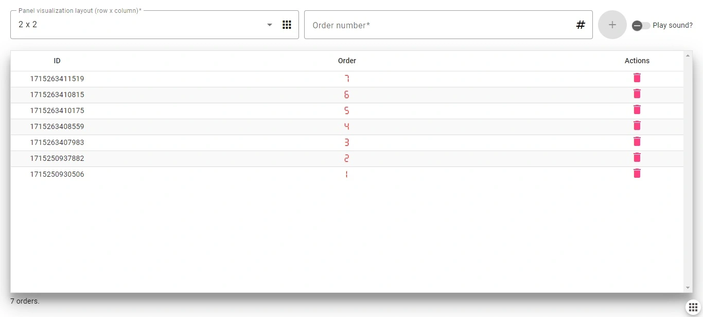

# Frontend do Painel de Chamadas

Esse aplicativo pode ser usado como um painel eletrônico para lanchonetes.

### Panel (tela para os clientes)

## Admin

1. O número dos pedidos serão incuídos ou excluídos;
2. O Layout (linha x coluna) de exibição pode ser alterado;
3. É possível suprimir o som na inclusão de novos pedidos.

Nesse projeto foi usado o Angular 17 e o Socket.io para envio e recebimento das informações em tempo real.

# Detalhes para execução do projeto:

1. Entrar no diretório onde o projeto será clonado;
2. Abrir o Git Bash;
3. Executar git clone https://github.com/marcinhuk/PainelDeChamadas-Frontend.git;
4. Executar cd ./PainelDeChamadas-Frontend;
5. Executar npm install;
6. Criar a pasta "environments" dentro de "/src";
6. Criar os arquivos abaixo dentro da pasta "/src/environments":
	- environments.dv.ts
	- environments.pd.ts
7. Dentro de cada arquivo crias as variáveis abaixo:
	- export const API_BASE_URL = 'http://localhost:3000'
	- export const SOCKET_IO_BASE_URL = 'http://localhost:3000'
8. Executar npm start.